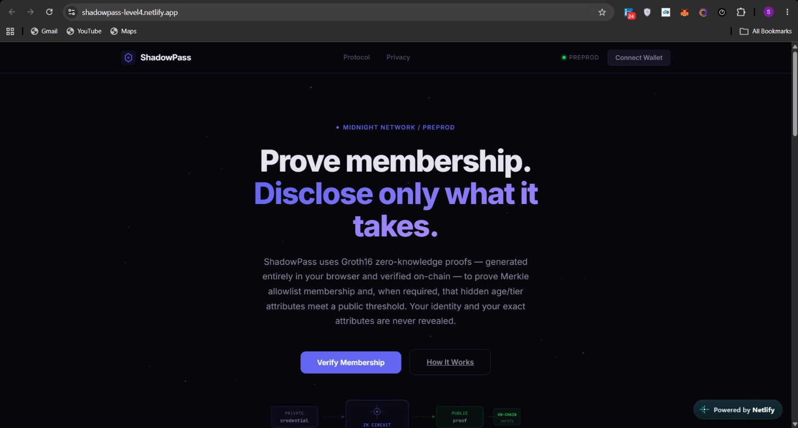
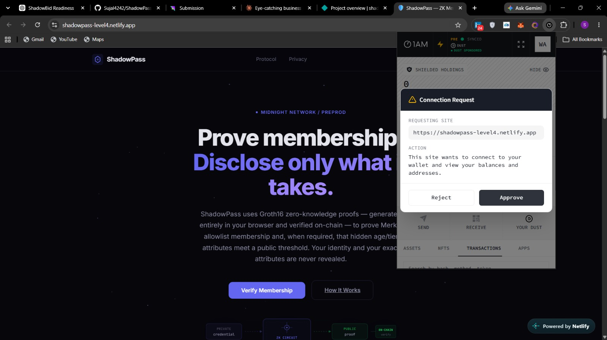
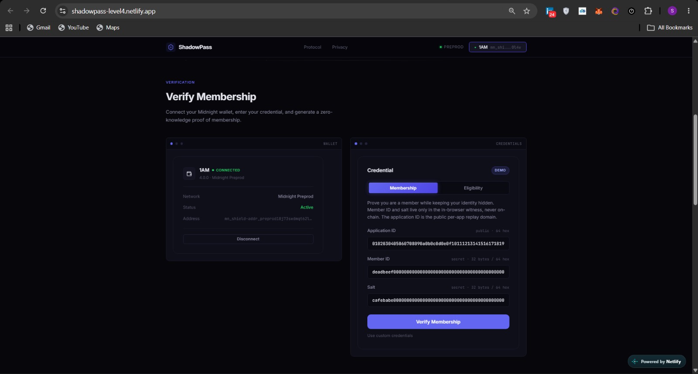
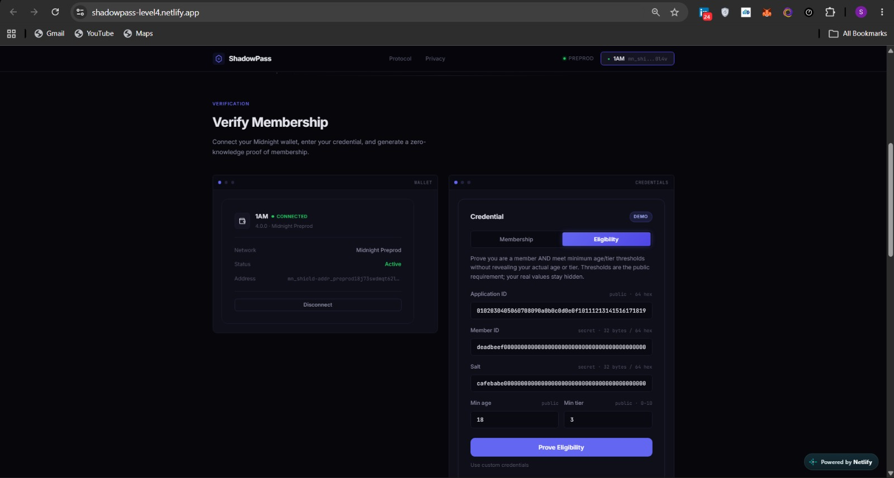
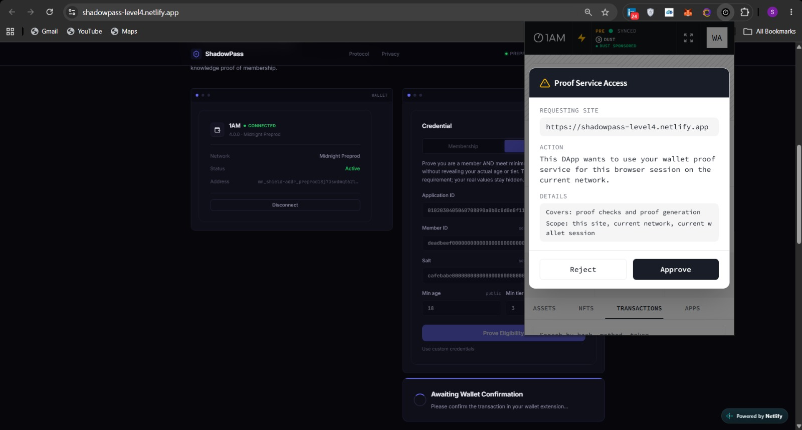
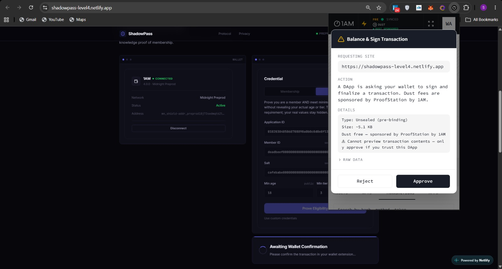
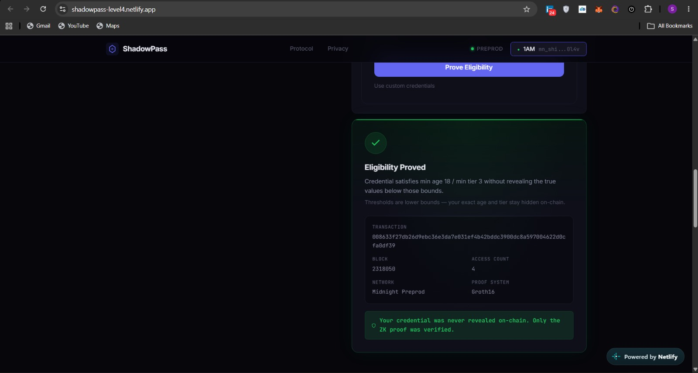
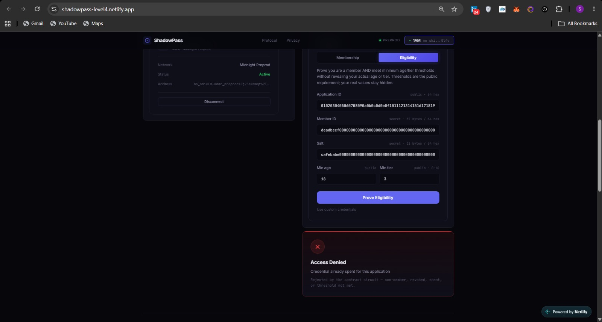

# ShadowPass Level 4

**Verifiable Access Credentials on Midnight — reusable, selectively-disclosable, serverless.**


ShadowPass is a Midnight dApp for **privacy-preserving access control**. Where level 3 proved membership against a fixed 8-slot allowlist, Level 4 introduces *verifiable credentials*: encoded on-chain as Merkle-tree commitments, reusable across applications, protected against replay by per-application nullifiers, revocable by the issuer, and **selectively disclosable** — a member can prove attributes like `age >= 18` without revealing age, identitity, or even *which* credential.

Everything runs without a backend: a **Compact smart contract** on **Midnight Preprod**, a browser frontend that generates the Groth16 proof locally via the Midnight wallet, a public indexer, static hosting, GitHub Actions, and an **offline issuer CLI** for credential lifecycle management.

## Live Demo

**[Launch ShadowPass →](https://shadowpass.netlify.app/)** (Level 4 build)

## Demo Video

**[Watch the Level 4 demo →](...)** (link in final release milestone)

## Follow ShadowPass

**[@shadowpass on X →](https://x.com/shadowpass)** — product updates, security notes, and release announcements. (Profile finalized in the release milestone.)

---

## Overview

Access control leaks identity. Every badge scan, every login, every credential check creates a trail of *who accessed what, when*. ShadowPass breaks the trail: the blockchain learns only that *a* valid credential was presented — never who owns it, never which one.

Level 4 adds the primitives that make this a real credential system:

| Capability | Level 3 | Level 4 |
|---|---|---|
| Membership storage | 8 fixed slots | **Merkle tree allowlist (1024 capacity)** |
| Enrollment | Deploy-time only | **Post-deploy, issuer-authorized (no server)** |
| Reusability | One fixed flow | **One credential, per-application nullifiers** |
| Replay protection | None | **Deterministic per-app single-use nullifiers** |
| Selective disclosure | None | **Prove `age >= t` / `tier >= t` without revealing them** |
| Revocation | None | **Issuer revoke/unrevoke of app-nullifiers** |
| Proof format | Groth16 | Groth16 (browser-generated) |

---

## What the demo shows

1. Import a credential issued by the issuer CLI (demo credential is public and documented).
2. Connect the Midnight wallet.
3. Pick an application context (`appId`) and either:
   - **Verify membership** — prove membership without revealing memberId, salt, or tree position, or
   - **Prove eligibility** — e.g. `age >= 21` and `tier >= 3`, without revealing age, tier, or identity.
4. The wallet generates the Groth16 proof locally and submits it.
5. The contract verifies the proof, blocks replays via the per-app nullifier, checks revocation status, and records the access.
6. **Denied** states (non-member, replayed credential, revoked credential, below threshold) are rejected with distinct reasons.

---

## How it works

```
Issuer CLI (offline)                     Browser (member)                 On-chain (Preprod)
┌──────────────────────┐          ┌────────────────────────┐          ┌──────────────────────┐
│ generate credential   │          │ import credential      │          │ MerkleTree<1024>     │
│ (memberId, age, tier, │          │ (memberId, age, tier,  │          │ usedNullifiers map   │
│  salt)                │          │  salt)                 │          │ revoked map          │
│ enroll() → commitment ───────►   │ proveEligibility(      │          │ accessCount          │
│ revoke(appId)         │          │   appId, minAge,       │          │ issuerCommitment     │
│ unrevoke(appId)       │          │   minTier)              │          │ ┌────────────────┐  │
└──────────────────────┘          │ Groth16 proof in-       │          │ │ proveEligibility│ │
                                  │  browser → wallet signs │          │ │ verifyMembership│ │
                                  │  → submits tx           ──────────► │ │ enroll/revoke   │ │
                                  └────────────────────────┘          │ └────────────────┘  │
                                                                      └──────────────────────┘
```

- The credential `(memberId, age, tier, salt)` never leaves the device. Only its *commitment* is stored on-chain.
- The Merkle proof path (and therefore the exact tree position) stays **private** inside the ZK circuit — the contract only sees a recomputed root.
- `verifyMembership` proves commitment preimage knowledge **and** tree membership in one proof.
- `proveEligibility` adds in-circuit predicates over hidden `Uint<8>` attributes.
- A per-app nullifier `persistentHash(use | appId | memberId | salt)` makes each credential single-use *per application*, so one credential works across many apps without cross-app linkability.

### What becomes public
The Groth16 proof, the recomputed Merkle root (already public in the ledger), the nullifier, the threshold values requested, and the access-count increment.

### What always stays private
`memberId`, `salt`, `age`, `tier`, and **which Merkle leaf** (tree position) the credential lives at.

---

## Smart Contract

New contract at [`contracts/shadowpass4.compact`](contracts/shadowpass4.compact). The Level 3 `contracts/shadowpass.compact` is retained unchanged for history and is **not** used by the Level 4 app.

```compact
export struct MemberRecord {
  memberId: Bytes<32>;
  age: Uint<8>;
  tier: Uint<8>;
}

export ledger memberships:      MerkleTree<10, Bytes<32>>;
export ledger usedNullifiers:   Map<Bytes<32>, Bytes<32>>;
export ledger revokedNullifiers: Map<Bytes<32>, Boolean>;
export ledger accessCount:      Field;
export ledger issuerCommitment: Bytes<32>;
```

| Circuit | Authorized by | Effect |
|---|---|---|
| `enroll()` | Issuer (commitment preimage) | Inserts a credential commitment into the tree |
| `revoke(appId)` / `unrevoke(appId)` | Issuer | Revokes/un-revokes the app-nullifier of a known credential |
| `verifyMembership(appId)` | Holder (commitment preimage + tree membership) | Proof, nullifier recorded, access count |
| `proveEligibility(appId, minAge, minTier)` | Holder | Membership + attribute predicates, nullifier recorded |

Two security-critical details encoded in the circuits (`docs/security-model.md` for the full write-up):

1. **Commitment-bound membership** — `assert(path.leaf == memberCommitment)` ties the Merkle path to the credential's commitment. Without it, a prover could present *any* real tree path, breaking membership binding.
2. **No `ownPublicKey` in the nullifier** — `ownPublicKey()` is a *witness function*, not authentication; adding it to a nullifier would let a prover dodge replay protection by rotating keys. Authorization is the credential-knowledge proof only.

---

## Architecture

Same serverless backbone as Level 3, upgraded with real witnesses:

- **7 midnight-js providers** assembled in `frontend/src/midnight/providers.ts` (FetchQzk config, wallet-delegated Groth16 prover with HTTP fallback, in-memory private state, public indexer, wallet, midnight).
- **Witness implementations** in `frontend/src/midnight/witnesses.ts` — `record`, `recordSalt`, `membershipPath` (via `ledger.memberships.findPathForLeaf`), `issuerKey`.
- **Static ZK assets** (`zkir`, `keys`) copied to `frontend/public/midnight/shadowpass4` and fetched at runtime.
- **Netlify** static hosting with a reproducible build script; **GitHub Actions** CI/CD.
- **Offline issuer CLI** (`scripts/issuer-cli.ts`) for credential generation, issuance/enrollment, and revocation — no hosted backend anywhere.

---

## Security model & privacy

Full write-up: [`docs/security-model.md`](docs/security-model.md) (presented with the Level 4 privacy milestone).

Highlights:
- Authorization = knowledge of a credential whose commitment is an on-chain Merkle leaf (plus, for eligibility, attribute predicates verified in-circuit).
- `ownPublicKey()` is **never** used for authorization; it does not authenticate the transaction signer in Midnight, and signature-verification circuits (`jubjubSchnorrVerify`, `secp256k1EcdsaVerify`) are unavailable in Compact 0.31.1. This is a documented trade-off, not a workaround.
- Nullifiers are wallet-independent and per-application, giving strong replay prevention and cross-app unlinkability.
- Revocation requires the issuer to know the credential (they issued it in the demo flow); revocation never reveals the credential to third parties — only its app-nullifier is published.
- Tree leaves are Pedersen commitments (`persistentCommit`) — even dictionary attacks are impractical (256-bit `memberId`).

---

## Running locally

**Requirements:** Node.js >= 22, Midnight wallet extension (1AM or Lace), Compact CLI 0.31.1.

```bash
# Install
npm install
npm --prefix frontend install

# Compile contract (generates Groth16 keys — 5 circuits) + copy ZK assets
npm run compile
npm run copy-zk-assets

# Tests (contract logic, Groth16 proofs, issuer CLI, privacy)
npm test

# TypeScript checks
npm run build
npm run build:deploy

# Dev server → http://localhost:5173
npm run dev:frontend

# Production build
npm run build:frontend
```

### Issuer CLI (demonstrates the serverless issuance model)

```bash
# Generate an issuer key + a set of demo credentials, enroll them on-chain
SHADOWPASS4_ISSUER_KEY=<hex> npm run issuer:seed
cat .shadowpass-issuer/credentials.json   # share one credential with a test user

# Revoke / un-revoke a credential for a given application
npm run issuer:revoke -- --appId <hex> --memberId <hex> --salt <hex>
npm run issuer:unrevoke -- --appId <hex> --memberId <hex> --salt <hex>
```

Commands are idempotent and read/write a local keystore under `.shadowpass-issuer/` (gitignored).

---

## Testing

| Suite | File | Covers |
|---|---|---|
| Contract membership | `tests/contract-membership.test.ts` | enroll, authorized/stranger/path-binding, root checks |
| Eligibility | `tests/contract-eligibility.test.ts` | threshold pass/fail boundaries, hidden attributes |
| Nullifier & revocation | `tests/contract-nullifier-revocation.test.ts` | replay rejection, revoke/unrevoke, revoked-use denial |
| Privacy | `tests/contract-privacy.test.ts` | no `memberId`/`salt`/`age`/`tier`/commitment/position in transcript |
| Groth16 prove + verify | `tests/contract-membership.test.ts` + `tests/contract-eligibility.test.ts` | real Groth16 prove/verify against a deployed-state binding |
| Issuer CLI | `tests/issuer-cli.test.ts` | credential determinism, keystore, unauthorized rejection |
| Wallet state | `tests/wallet-state.test.ts` | persisted deploy-wallet state round-trips |

All suites run headless (no chain, no browser): Groth16 proof generation and on-chain-verifier binding checks run against the compiled contract locally.

---

## CI/CD

`.github/workflows/ci.yml` — on push/PR to `main`: install Compact 0.31.1, `npm ci` (root + frontend), compile the contract, typecheck, build the frontend, run all unit tests.

`netlify.toml` — Netlify builds reproducibly (install Compact 0.31.1, `npm install` root + frontend, compile the contract, `npm run build:frontend`) and publishes `frontend/dist`.

---

## Preprod deployment

| Field | Value |
|---|---|
| **Network** | Midnight Preprod |
| **Contract** | `shadowpass4` at `contracts/shadowpass4.compact` |
| **Address** | set in the deployment milestone — see `docs/evidence/LEVEL4-DEPLOYMENT.md` |
| **Compiler** | Compact 0.31.1 |
| **Runtime** | compact-runtime 0.16.0 |

Deployment is a one-time scripted operation (`scripts/deploy-v4.ts`) using the same persisted-wallet pattern proven in Level 3. No deployment secrets are ever committed.

---

## Level 4 Live Demo / Evidence

End-to-end browser captures of the live Midnight Preprod flow (Groth16 proving delegated to the Midnight wallet). The credential shown is the public demo credential; the wallet handles the user interface, signature, and on-chain submission.

















On-chain Level 4 proof and access evidence is recorded in `docs/evidence/LEVEL4-DEPLOYMENT.md`.

---

## Repository layout

```
contracts/shadowpass4.compact   Level 4 Compact contract
scripts/issuer-cli.ts           Offline issuer CLI (credentials, enroll, revoke)
scripts/deploy-v4.ts            One-time deployment to Preprod
scripts/wallet-state.ts         Deploy-wallet sync persistence
frontend/                       React 19 + Vite 6 browser dApp
tests/                          Contract, ZK, privacy, CLI, wallet-state tests
docs/security-model.md          Level 4 privacy + wallet-binding write-up
docs/evidence/                  Deployment evidence, Phase-0 feasibility
```

---

## License

[MIT](LICENSE)